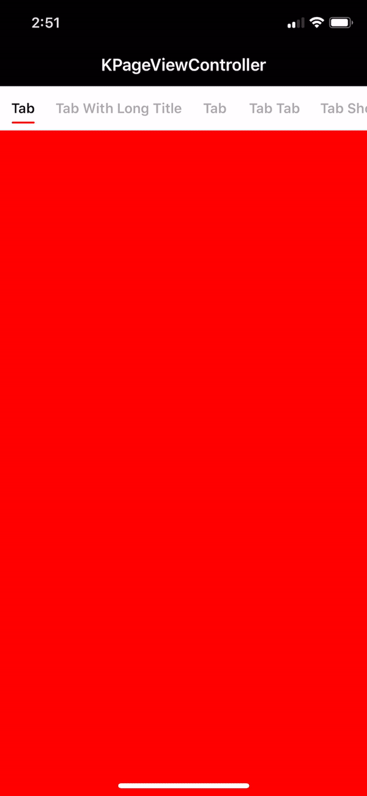

# KPageViewController

A flexiable and easy to use view pager library for Swift.

## Preview


## Setup
You may customize your segmented control by configuration:
```
let options = SegmentedControlOptions.default
options.segmentedTitles = ["Tab", "Tab With Long Title", "Tab", "Tab Tab", "Tab Showing in Half"] // YOUR [TITLEs]
options.segmentButtonFontSize = 14  //YOUR FONT SIZE
options.selectedTitleColor = .black // the button title color in selected / highlighed state
options.deSelectedTitleColor = .lightGray // the button title color in normal state
options.indicatorColor = .red // the indicator color
```

More configurable options:
```
var segmentedTitles: [String]
var segmentedViewBackgroundColor: UIColor
var selectedTitleColor: UIColor
var deSelectedTitleColor: UIColor
var indicatorColor: UIColor
var hasRedDot: [Bool]?
var segmentButtonFontSize: CGFloat
var navigateToTabIndex: Int
var isDynamicTabWidth: Bool
```

Simply render the view controllers with background color:
```
let colors = [UIColor.red, UIColor.blue, UIColor.green, UIColor.yellow, UIColor.purple]
var vcs: [UIViewController] = []
for color in colors {
    let vc = UIViewController()
    vc.view.backgroundColor = color
    vcs.append(vc)
}
```

Initialize your PageViewController:
```
let pageVC = PageViewController(viewControllers: vcs)
```

## Example
```
let options = SegmentedControlOptions.default
options.segmentedTitles = ["Tab", "Tab With Long Title", "Tab", "Tab Tab", "Tab Showing in Half"] // YOUR [TITLEs]
options.segmentButtonFontSize = 14  //YOUR FONT SIZE
options.selectedTitleColor = .black // the button title color in selected / highlighed state
options.deSelectedTitleColor = .lightGray // the button title color in normal state
options.indicatorColor = .red // the indicator color

let colors = [UIColor.red, UIColor.blue, UIColor.green, UIColor.yellow, UIColor.purple]
var vcs: [UIViewController] = []
for color in colors {
    let vc = UIViewController()
    vc.view.backgroundColor = color
    vcs.append(vc)
}

let pageVC = PageViewController(viewControllers: vcs)
self.pushViewController(pageVC, animated: false)
```

## Requirements
iOS 9.0 or above <br/>
Support Swift 5.0

## Installation
PageViewController is available through CocoaPods. To install it, simply add the following line to your Podfile:

```
pod "KPageViewController"
```

## Author
Mr. Kam Chun Kit

## License
KPageViewController is available under the MIT license. See the LICENSE file for more info.
