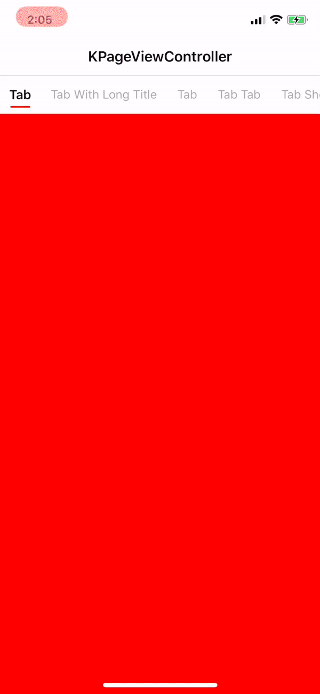

# KPageViewController



## Example
```
class ExampleViewController: PageViewController {

    override func viewDidLoad() {
        super.viewDidLoad()
        // Do any additional setup after loading the view.
        self.dynamicWidthTab = true
        self.segmentedTitles = ["Tab 1", "Tab 2", "Tab 3", "Tab 4", "Tab 5"]
        self.viewControllers = [UIViewController(), UIViewController(), UIViewController(), UIViewController(), UIViewController()]
        self.reveal()
    }
}
```

## Requirements
iOS 9.0 or above
Swift 5.0

## Installation
PageViewController is available through CocoaPods. To install it, simply add the following line to your Podfile:

```
pod "KPageViewController"
```

## Author
Mr. Kam Chun Kit

## License
KPageViewController is available under the MIT license. See the LICENSE file for more info.
